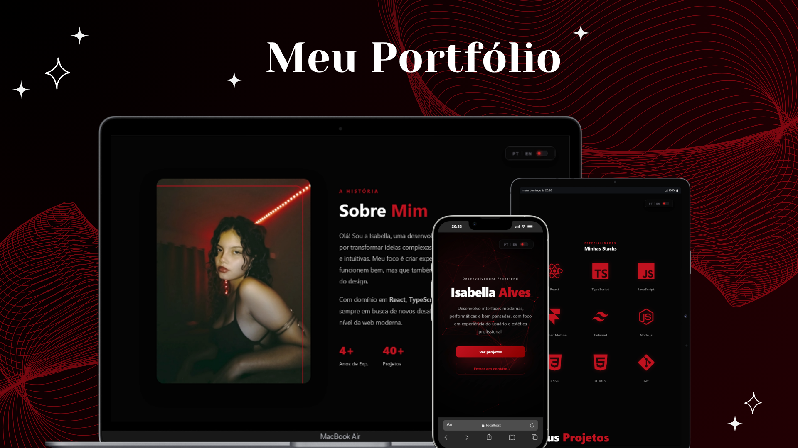

# 💻 Isabella Alves | Front-end Developer

<p align="center">
  
</p>

## ✍️ Sobre o Projeto
Este portfólio foi desenvolvido para ser uma experiência digital imersiva, unindo design sofisticado e performance técnica. O objetivo principal é demonstrar o domínio de tecnologias modernas de Front-end, com foco em interfaces fluidas, responsivas e acessíveis.

## 🚀 Funcionalidades de Destaque
* **🌍 Global Reach (i18n):** Suporte nativo a multi-idioma (PT-BR/EN) via `i18next`, permitindo a troca dinâmica de conteúdo sem reload.
* **🎬 Interactive UI:** Navegação de projetos em estilo "Slide Code" utilizando `Swiper.js`, com efeitos de zoom e overlays dinâmicos.
* **✨ Motion Design:** Animações fluidas integradas com `Framer Motion` e interações 3D com `react-parallax-tilt`.
* **📱 Mobile First:** Layout totalmente responsivo e otimizado para todos os tamanhos de tela.

## 🛠️ Tech Stack
* **Core:** React.js + TypeScript + Vite
* **Styling:** CSS3 (Custom Properties) & Tailwind CSS
* **Animations:** Framer Motion & Parallax Tilt
* **Experience:** Swiper.js & i18next (Internationalization)

---

## 🔧 Como rodar o projeto localmente

1. Clone o repositório:
   ```bash
   git clone [https://github.com/IsabellaAlves2009/IsabellaAlves.git](https://github.com/IsabellaAlves2009/IsabellaAlves.git)